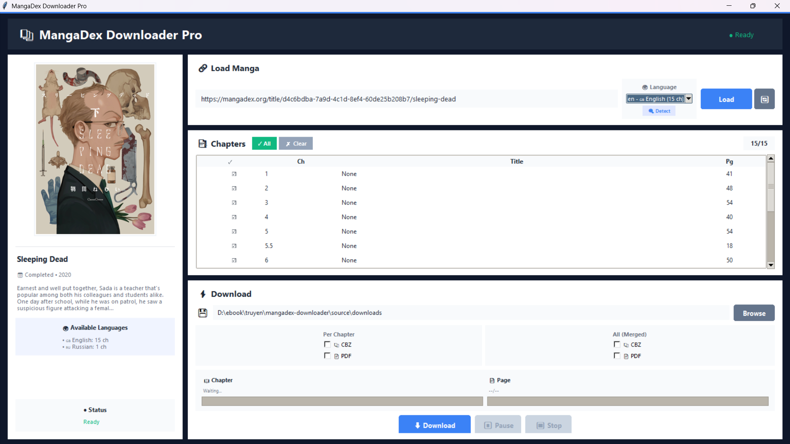

# 📚 MangaDex Downloader Pro

<div align="center">


**A powerful, fast, and user-friendly manga downloader for MangaDex with multi-threaded downloads**

[Features](#-features) • [Installation](#-installation) • [Usage](#-usage) • [Screenshots](#-screenshots) • [Building](#-building-from-source) • [FAQ](#-faq)

</div>

---

## 🌟 Features

### ⚡ High-Speed Downloads
- **10x Faster** - Multi-threaded downloads (up to 20 concurrent threads)
- **Smart Retry** - Automatic retry for failed downloads
- **Resume Support** - Continue interrupted downloads
- **Bandwidth Control** - Limit download speed (optional)

### 🌍 Multi-Language Support
- **Auto-Detect** - Automatically detect available translations
- **45+ Languages** - English, Japanese, Spanish, Russian, Chinese, Korean, and more
- **Smart Filter** - Only show chapters in selected language

### 📦 Multiple Export Formats
- **CBZ** (Comic Book Archive) - Per chapter or merged
- **PDF** - Per chapter or merged  
- **Images** - Original quality (JPG/PNG/WebP)
- **Organized** - Auto-named as `00.png` (cover), `01.png`, `02.png`, etc.

### 🎨 Modern User Interface
- **Dark Theme** - Beautiful gradient design
- **Real-time Progress** - Chapter and page progress bars with speed display
- **Cover Preview** - See manga cover before downloading
- **Easy Controls** - Pause, Resume, Stop anytime

### 🛡️ Reliability
- **Error Handling** - Detailed error logs and reporting
- **File Integrity Check** - Verify and auto-fix corrupt files
- **Missing Page Detection** - Identify and retry failed pages
- **No Data Loss** - Safe download with automatic cleanup

---

## 📋 Requirements

- **Python 3.8+** (for running from source)
- **Operating System**: Windows 10/11, macOS 10.14+, or Linux
- **Internet Connection**:  Stable connection recommended
- **VPN** (Optional): ProtonVPN recommended for optimal performance

---

## 🚀 Installation

### Option 1: Download Executable (Windows - Easiest)

1. Go to [Releases](https://github.com/hashi173/Mangadex-Downloader/releases)
2. Download `MangaDexDownloaderPro.exe`
3. Run `MangaDexDownloaderPro.exe`

**No Python installation required!** ✨

### Option 2: Run from Source (All Platforms)

#### Step 1: Install Python

Download Python 3.8+ from [python.org](https://www.python.org/downloads/)

**Important**:  Check ✅ **"Add Python to PATH"** during installation

#### Step 2: Clone Repository

```bash
git clone https://github.com/hashi173/Mangadex-Downloader.git
cd Mangadex-Downloader
```

#### Step 3: Install Dependencies

**Windows:**
```bash
python -m venv . venv
.venv\Scripts\activate
pip install -r requirements.txt
```

**macOS/Linux:**
```bash
python3 -m venv . venv
source .venv/bin/activate
pip install -r requirements.txt
```

#### Step 4: Run Application

```bash
python source/main.py
```

---

## 📖 Usage

### Quick Start Guide

1. **Launch the App**
   ```bash
   # If using executable
   MangaDexDownloaderPro.exe
   
   # If running from source
   python source/main.py
   ```

2. **(Optional) Connect VPN**
   - Download [ProtonVPN](https://protonvpn.com/) (free)
   - Connect to any server (recommended:  Japan, US, Europe)
   - Better performance and avoid rate limits

3. **Load Manga**
   - Go to [MangaDex. org](https://mangadex.org)
   - Find your manga and copy URL
   - Paste URL into app
   - Click **🔍 Detect** to find available languages
   - Select language from dropdown
   - Click **Load** button

4. **Select Chapters**
   - Click **✓ All** to select all chapters
   - Or click individual chapters to toggle
   - Click **✗ Clear** to deselect all

5. **Choose Export Format** (optional)
   - **Per Chapter**: Separate CBZ/PDF for each chapter
   - **All (Merged)**: Single CBZ/PDF with all chapters combined

6. **Start Download**
   - Choose save location (click **Browse**)
   - Click **⬇ Download** button
   - Monitor real-time progress with speed display

7. **Control Download**
   - **⏸ Pause**: Temporarily pause download
   - **▶ Resume**: Continue paused download
   - **⏹ Stop**: Stop and save progress

---

## 🎯 Features Explained

### ⚡ Turbo Download Mode

Downloads up to 20 pages simultaneously: 

```
Normal Mode:    [▓▓░░░░░░░░] 20% - 1 page/time  (~1 MB/s)
Turbo Mode:    [▓▓▓▓▓▓▓▓▓░] 90% - 10 pages/time (~4 MB/s) ⚡
Ultra Mode:    [▓▓▓▓▓▓▓▓▓▓] 100% - 20 pages/time (~8 MB/s) 🚀
```

### 🌍 Language Auto-Detection

Automatically detects all available translations:

```
🔍 Detecting languages... 

Found: 
✓ English (150 chapters)
✓ Spanish (120 chapters)
✓ Russian (100 chapters)
✓ French (80 chapters)
```

### 🔄 Smart Retry System

Automatically retries failed downloads: 

```
Download Phase: 
✓ Page 01-49: Success
✗ Page 50: Failed

Retry Phase: 
🔄 Retrying page 50...  Success! 

Result:  50/50 pages ✓
```

### 📦 Export Formats

**CBZ (Comic Book Archive)**
- Standard format for comic readers
- Compatible with:  CDisplayEx, YACReader, Panels, etc.
- Preserves image quality

**PDF (Portable Document Format)**
- Universal format, read on any device
- Auto-resized to A4 for optimal viewing
- Perfect for tablets and e-readers

---

## 📂 Output Structure

```
downloads/
└── Manga Title/
    ├── Chapter 1/
    │   ├── 00.png          ← Cover image
    │   ├── 01.png          ← Page 1
    │   ├── 02.png          ← Page 2
    │   └── ... 
    ├── Chapter 1. cbz       ← CBZ archive (if enabled)
    ├── Chapter 1.pdf       ← PDF file (if enabled)
    ├── Chapter 2/
    ├── Chapter 2.cbz
    ├── Chapter 2.pdf
    ├── ...
    ├── Manga Title_Complete.cbz  ← All chapters merged
    └── Manga Title_Complete.pdf  ← All chapters merged
```

---

## 🖼️ Screenshots

### Main Interface
<div align="left">
<div align="left">
  
  <p><i>Modern dark theme interface with real-time progress tracking</i></p>
</div>


---

## 🔧 Building from Source

### Build Executable (Windows)

1. **Install PyInstaller**
   ```bash
   pip install pyinstaller
   ```

2. **Run Build Script**
   ```bash
   python build_exe.py
   ```

3. **Output**
   ```
   dist/MangaDexDownloaderPro.exe
   ```

### Build with Spec File (Advanced)

```bash
pyinstaller MangaDexDownloaderPro.spec
```

### Create Release Package

```bash
python build_release.py
```

Output:  `MangaDexDownloaderPro_v1.0.0_Windows_x64.zip`

---

## ❓ FAQ

### Q: Do I need a VPN?
**A:** Not required, but **highly recommended**. ProtonVPN (free) helps with: 
- Faster download speeds (avoid ISP throttling)
- Bypassing regional restrictions
- Avoiding rate limits

### Q: Why is my download slow?
**A:** Try these solutions:
1. Connect to ProtonVPN (different server)
2. Close other applications using internet
3. Check your internet speed
4. Try downloading during off-peak hours

### Q:  Can I download multiple manga at once?
**A:** Currently downloads one manga at a time for optimal performance.  Queue system coming soon!

### Q: Where are my downloads saved?
**A:** Default:  `downloads/` folder in app directory.  Change via **Browse** button.

### Q: What if download fails?
**A:** The app automatically: 
1. Retries failed pages 3 times
2. After completing all chapters, retries all failures again
3. Shows detailed error report with missing pages

### Q: Can I resume interrupted downloads?
**A:** Yes!  The app saves progress.  Simply restart and it continues from where it stopped.

### Q: What comic readers support CBZ files?
**A:** Popular options: 
- **Windows**: CDisplayEx, YACReader, SumatraPDF
- **macOS**: YACReader, Simple Comic, Panels
- **iOS**: Panels, Chunky Reader, YACReader
- **Android**: Tachiyomi, Perfect Viewer

### Q: Are PDFs optimized for tablets?
**A:** Yes! PDFs are auto-resized to A4 format, perfect for tablets and e-readers.

### Q: Is this legal?
**A:** This tool downloads from MangaDex, which hosts user-uploaded scanlations. Always support official releases when available! 

---

## 🐛 Troubleshooting

### Issue: "ModuleNotFoundError"
**Solution:**
```bash
pip install -r requirements.txt
```

### Issue: Cover image not loading
**Solution:**
- Check VPN connection
- Wait a few seconds and try again
- Some manga may not have covers

### Issue: "Connection timeout"
**Solution:**
1. Connect to ProtonVPN
2. Try a different VPN server
3. Check firewall settings

### Issue: Language detection shows 0 languages
**Solution:**
- Check internet connection
- Verify manga URL is correct
- Try loading manga again

### Issue:  Antivirus blocks executable
**Solution:**
- This is a false positive from PyInstaller
- Add executable to whitelist/exclusions
- Or run from source code

---

## 🛠️ Technical Details

### Dependencies

```
requests>=2.31.0      # HTTP requests
Pillow>=10.0.0        # Image processing  
reportlab>=4.0.4      # PDF generation
PyPDF2>=3.0.1         # PDF merging
urllib3>=2.0.0        # HTTP connection pooling
```

### Architecture

```
mangadex-downloader/
├── source/
│   ├── main.py                        # Entry point
│   ├── api/
│   │   └── mangadex_api.py           # MangaDex API wrapper
│   ├── downloader/
│   │   └── turbo_downloader.py       # Multi-threaded downloader
│   └── gui/
│       └── main_window.py            # Tkinter GUI
├── build_exe.py                       # Build script
├── requirements.txt                   # Dependencies
└── README.md
```

### Performance

| Mode | Threads | Speed | Time (50 pages) |
|------|---------|-------|-----------------|
| Normal | 3 | ~1 MB/s | ~100s |
| Turbo | 10 | ~4 MB/s | ~25s ⚡ |
| Ultra | 20 | ~8 MB/s | ~12s 🚀 |

**Memory Usage**:  ~150-250 MB  
**CPU Usage**: Low (10-20%)

---

### Development Setup

```bash
# Clone your fork
git clone https://github.com/YOUR_USERNAME/Mangadex-Downloader.git

# Create virtual environment
python -m venv . venv
source .venv/bin/activate  # Windows: .venv\Scripts\activate

# Install dependencies
pip install -r requirements.txt

# Run tests (if available)
python -m pytest
```

---

## 📜 License

This project is licensed under the **MIT License** - see the [LICENSE](LICENSE) file for details.

```
MIT License

Copyright (c) 2024 MangaDex Downloader Pro

Permission is hereby granted, free of charge, to any person obtaining a copy
of this software and associated documentation files (the "Software"), to deal
in the Software without restriction, including without limitation the rights
to use, copy, modify, merge, publish, distribute, sublicense, and/or sell
copies of the Software. 

THE SOFTWARE IS PROVIDED "AS IS", WITHOUT WARRANTY OF ANY KIND, EXPRESS OR
IMPLIED, INCLUDING BUT NOT LIMITED TO THE WARRANTIES OF MERCHANTABILITY,
FITNESS FOR A PARTICULAR PURPOSE AND NONINFRINGEMENT. 
```

---

## 🙏 Acknowledgments

- **MangaDex** - For providing the API and hosting manga
- **Scanlation Groups** - For translating manga
- **Python Community** - For amazing libraries
- **ProtonVPN** - For free VPN service
- **Contributors** - Thank you for your contributions!

---


<div align="left">

**Made with ❤️ for manga lovers worldwide by Hashi**

⭐ **Star this repo if you like it!** ⭐

[⬆ Back to top](#-mangadex-downloader-pro)

</div>